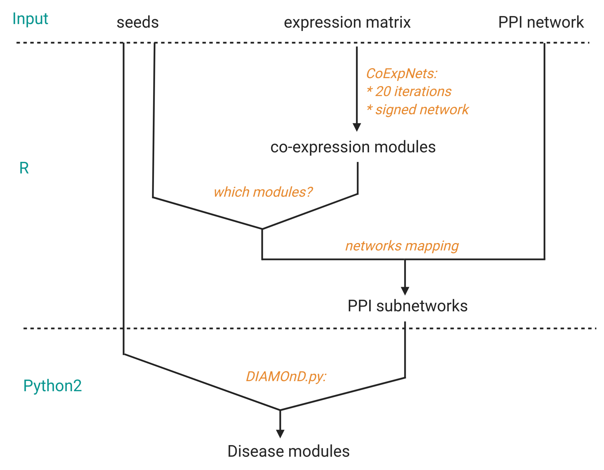

# coexp-diamond

### Introduction
The coexp-diamond pipeline allows to reveal disease module networks from RNA sequencing data. The workflow consists of three main parts:
1.   Co-expression network construction out of custom expression matrix. The analysis is run with a [CoExpNets R package](https://github.com/juanbot/CoExpNets).
2.   Co-expression to protein-protein interaction (PPI) network mapping.
3.   Disease module identification within obtained PPI subnetworks: performed with a [DIAMOnD script](https://github.com/dinaghiassian/DIAMOnD). 

### Installation
To run coexp-diamond pipeline the following R packages are required:
* RankProd
* gmp
* CoExpNets
* readr
* data.table
* optparse
* filesstrings
* CoExpNets

CoExpNets should be installed and DIAMOnD.py should be executable and located in the PATH environment. Please check the installation manuals for CoExpNets and DIAMOnD. 

### Running pipeline
A typical command to run the pipeline is following:

```bash
./coexp-diamond.R -i expression_matrix.txt -s seed_genes.txt -w ppi_network.txt
```
### Output files:
The output directory will be located in the working directory with a default name coexp_diamond. Lists of genes grouped by CoExpNets module names are located in the output_diamond subdirectory.
```bash
└── coexp_diamond
    ├── input_diamond
    └── output_diamond
```

[](http://www.dzne.de)
